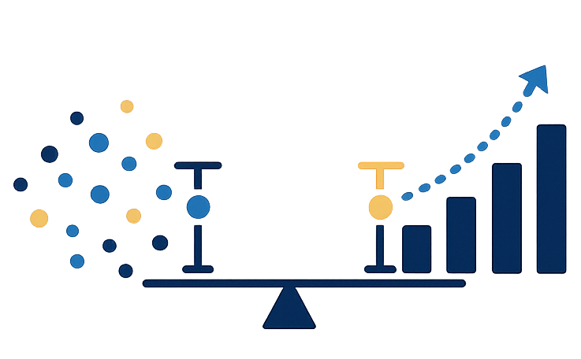

# pytest-familywise

A pytest plugin for running multiple randomized tests while controlling the
family-wise error rate (FWER) via the Holm-Bonferroni step-down procedure. [![][docs-dev-img]][docs-dev-url]

## Motivation

A test suite that contains several independent statistical tests will, under the
null hypothesis, produce at least one false positive with probability greater
than the nominal level α.  For $m$ independent tests each at level $\alpha$ the FWER
is $1 - (1-\alpha)^m$.  Holm-Bonferroni corrects for this without being as
conservative as a plain Bonferroni adjustment.

The complication is that Holm-Bonferroni must process p-values from smallest to
largest — the threshold for rank *k* depends on the total count *m* and all
smaller p-values before it.  This plugin defers pass/fail decisions: every test
runs to completion first, p-values are collected, and then the procedure is
applied once to the full set.

## Installation and loading

Add the package as a dev dependency:

```
pip add --dev pytest-familywise
```

That is all that is needed.  The package declares a `pytest11` entry point:

```toml
# pyproject.toml
[project.entry-points."pytest11"]
random = "pytest_familywise"
```

pytest scans installed `pytest11` entry points at startup and loads matching
modules automatically.  The fixtures (`assertNotReject`, `ztest_sample_size`, etc.) are
defined at module level in `pytest_familywise`, so they become available in every
test file without any import or `conftest.py` change.


## Quick example

```python
import numpy as np
import scipy.stats

def test_uniform_marginals(ks_sample_size, assertNotReject):
    """Each output coordinate of our RNG should be marginally uniform."""
    n = ks_sample_size(effect_size=0.05)   # detect CDF deviation >= 5 pp
    samples = np.random.rand(n)
    result = scipy.stats.kstest(samples, "uniform")
    assertNotReject(result.pvalue)


def test_normal_mean_zero(ztest_sample_size, assertNotReject):
    """Standardised output should have mean zero"""
    n = ztest_sample_size(effect_size=0.3)   # Cohen's d = 0.3
    samples = np.random.randn(n)
    _, p = scipy.stats.ttest_1samp(samples, 0.0)
    assertNotReject(p)


def test_discrete_distribution(chisquare_sample_size, assertNotReject):
    """A categorical sampler should match its target probabilities."""
    n = chisquare_sample_size(effect_size=0.2, df=4)   # Cohen's w = 0.2
    observed = np.random.multinomial(n, [0.2] * 5)
    _, p = scipy.stats.chisquare(observed)
    assertNotReject(p)
```

Run with:

```
pytest --holm-alpha=0.05 --power=0.8
```

After all three tests complete, the plugin applies Holm-Bonferroni and appends
a summary to the terminal output:

```
============ Holm-Bonferroni correction  α=0.05  n=3 =============
  PASSED  p=0.312541  threshold=0.016667  test_rng.py::test_uniform_marginals
  PASSED  p=0.487302  threshold=0.025000  test_rng.py::test_normal_mean_zero
  PASSED  p=0.621088  threshold=0.050000  test_rng.py::test_discrete_distribution

  3 passed, 0 failed after Holm-Bonferroni correction
```

The exit code is non-zero if any test fails the corrected threshold.

## How the step-down procedure works

Given $m$ tests with p-values sorted ascending as $p_1 \le p_2 \le \cdots \le p_m$:

- At rank $k$, the threshold is $\alpha / (m - k + 1)$.
- Starting from $k = 1$, reject $H_0$ while $p_k \le \text{threshold}$.
- As soon as a p-value exceeds its threshold, stop rejecting — that test and
  all remaining ones fail.

This is more powerful than Bonferroni ($\alpha/m$ for all tests) because later ranks
receive a relaxed threshold once earlier hypotheses have been rejected.

## CLI options

| Option | Default | Description |
|---|---|---|
| `--holm-alpha` | `0.05` | Family-wise error rate for the Holm-Bonferroni procedure |
| `--power` | `0.8` | Per-test power used by the sample-size fixtures |

`--power` is per-test, not family-wise.  The sample-size fixtures use the
nominal `--holm-alpha` directly (not a Bonferroni-adjusted per-test level),
which is anticonservative for the first tests in the ordering but matches the
spirit of providing per-test sizing.

## Fixtures

### `assertNotReject`

```python
def test_something(assertNotReject):
    p = run_statistical_test()
    assertNotReject(p)   # registers the p-value; plugin decides pass/fail
```

The test passes if the null hypothesis is *not* rejected after Holm-Bonferroni
correction (i.e. the p-value is large enough).  It fails if H0 is rejected.

Calling `assertNotReject(p)` with a value outside [0, 1] raises `ValueError`.
If a test raises an exception before `assertNotReject` is called, it fails
normally and is excluded from the Holm-Bonferroni set.

### `ztest_sample_size`

```python
n = ztest_sample_size(effect_size=0.5)               # two-sided (default)
n = ztest_sample_size(effect_size=0.5, two_sided=False)
```

`effect_size` is Cohen's d.  Uses the exact closed form:

$$n = \left\lceil \left(\frac{z_\alpha + z_\beta}{d}\right)^2 \right\rceil$$

Returns per-group *n* for a two-sample test.

### `chisquare_sample_size`

```python
n = chisquare_sample_size(effect_size=0.3, df=4)
```

`effect_size` is Cohen's $w = \sqrt{\sum (p_i - p_{0i})^2 / p_{0i}}$; `df` is the degrees of
freedom (number of categories − 1 for goodness-of-fit).  Solves numerically via
the non-central χ² survival function.

### `ks_sample_size`

```python
n = ks_sample_size(effect_size=0.1)                 # one-sample
n = ks_sample_size(effect_size=0.1, two_sample=True) # per-group
```

`effect_size` is the maximum absolute CDF difference $\|F - G\|_\infty \in (0, 1]$.
Uses the DKW-inequality bound:

$$n \ge \frac{\left(\sqrt{\ln(2/\alpha)} + \sqrt{\ln(2/\beta)}\right)^2}{2\Delta^2}$$

where $\beta = 1 - \text{power}$.  For `two_sample=True` the effective sample size for the
two-sample KS statistic is $n_1 n_2/(n_1+n_2) = n_\text{each}/2$ (equal groups), so the
returned per-group count is double the formula above.

[docs-dev-img]: https://img.shields.io/badge/docs-dev-blue.svg
[docs-dev-url]: https://samanklesaria.github.io/pytest-familywise
